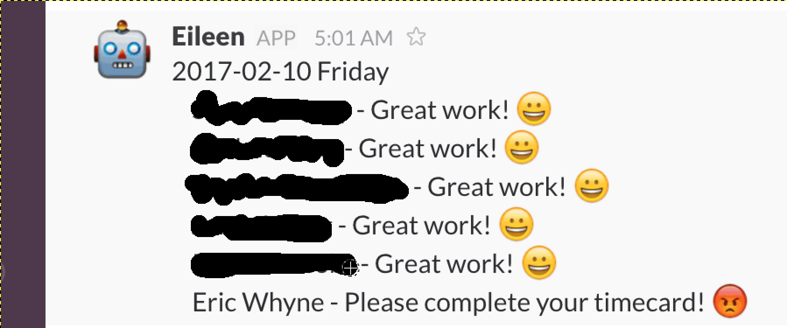

# Eileen
Eileen is a Slack and Bigtime timecard enforcement bot.



## Install
```
mkdir ~/.bigtime
mkdir ~/.bigtime/log
cp credentials ~/.bigtime
cp eileen-config ~/.bigtime
# Edit the credentials and config files
./eileen.py
```

We run Eileen every morning at 5:30 in a crontab to report on the previous days
time tracking compliance.
